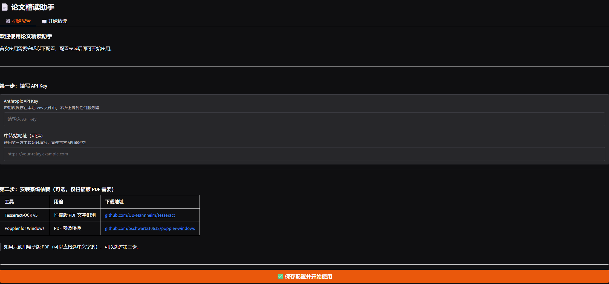
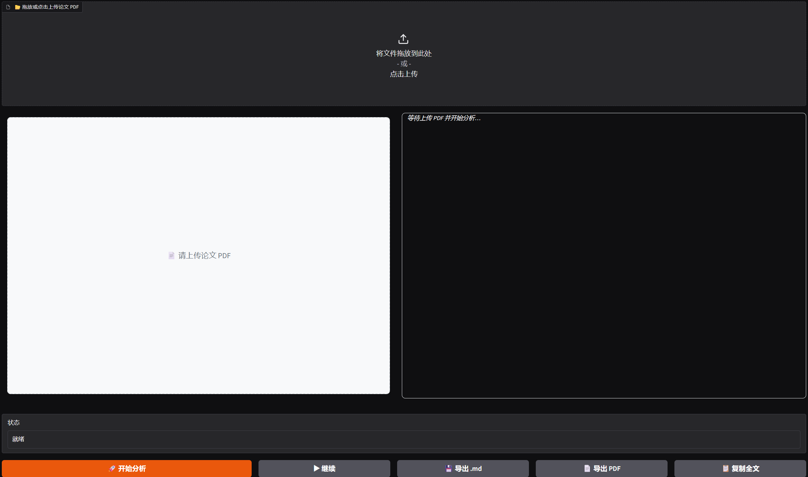

# Paper Reader | 论文精读助手

[English](#english) | [中文](#中文)

---

<a name="english"></a>
## 📚 Paper Reader

> An AI-powered desktop tool for in-depth paper reading and note-taking

[](https://opensource.org/licenses/MIT)
[](https://www.python.org/downloads/)

### ✨ Features

- **Intelligent PDF Parsing**: Automatically extracts text from academic papers with OCR fallback for scanned documents
- **AI-Powered Analysis**: Leverages Claude API to generate structured reading notes across 8 key sections
- **Real-time Preview**: Split-pane interface with PDF viewer and live markdown preview
- **Reference Verification**: Validates citations via CrossRef API and cross-checks numerical values
- **Export to Notion**: Generates markdown files with YAML front matter, ready for import
- **Resume Support**: Automatic checkpoint saves allow resuming interrupted analysis

### 📸 Screenshots

**Initial Setup Interface**



**Working Interface with Real-time Analysis**



### 📋 8-Section Note Structure

1. **Paper Metadata** (title, authors, venue, year, DOI)
2. **Core Contribution Summary** (one-sentence takeaway)
3. **Research Background** (problem statement, motivation)
4. **Technical Approach** (methodology, architecture)
5. **Experiments & Results** (datasets, metrics, findings)
6. **Key Insights** (innovations, limitations)
7. **Related Work** (comparison with prior art)
8. **Personal Reflection** (potential extensions, open questions)

### 🚀 Quick Start

#### Prerequisites (Windows)

1. **Python 3.8+**
2. **Tesseract-OCR v5.x** - [Download](https://github.com/UB-Mannheim/tesseract/wiki)
   - Install with Chinese Simplified + English language packs
   - Add to system PATH
3. **Poppler for Windows** - [Download](https://github.com/oschwartz10612/poppler-windows)
   - Extract and add `bin/` directory to system PATH

#### Installation

```bash
# Clone the repository
git clone https://github.com/yourusername/paper-reader.git
cd paper-reader

# Install Python dependencies
pip install -r requirements.txt

# Configure API key
copy .env.example .env
# Edit .env and fill in your ANTHROPIC_API_KEY
```

#### Configuration

Edit `.env`:

```env
# Required: Your Anthropic API key
ANTHROPIC_API_KEY=sk-ant-xxxxxxxx

# Optional: Model selection (default: claude-sonnet-4-6)
MODEL_NAME=claude-sonnet-4-6

# Optional: If using API proxy service (e.g., Antigravity)
ANTHROPIC_BASE_URL=https://your-proxy-url.com
```

#### Launch

```bash
python app.py
```

The application will automatically open in your default browser at `http://localhost:7860`

### 📖 Usage

1. **Upload PDF**: Click "Upload Paper (PDF)" and select your paper
2. **Start Analysis**: Click "开始精读" (Start Analysis) - the process takes ~3-5 minutes
3. **Real-time Preview**: Watch AI-generated notes appear incrementally in the right pane
4. **Review & Export**: Once complete, click "导出笔记" (Export Notes) to save as markdown
5. **Import to Notion**: Copy-paste the exported markdown into Notion

### 🛠️ Project Structure

```
paper-reader/
├── app.py                 # Gradio web interface
├── core/
│   ├── pdf_parser.py      # PDF text extraction & section splitting
│   ├── ai_engine.py       # Claude API integration with streaming
│   ├── validator.py       # CrossRef verification & numerical validation
│   ├── exporter.py        # Markdown generation & file I/O
│   └── history.py         # Reading history management
├── prompts/
│   └── note_template.py   # All AI prompt templates
├── data/
│   ├── history.json       # Reading history records
│   └── progress/          # Checkpoint files for resume support
├── assets/                # Static resources
├── .env.example           # Environment configuration template
├── requirements.txt       # Python dependencies
├── CLAUDE.md              # Developer documentation
└── README.md              # This file
```

### 🤝 Contributing

Contributions are welcome! Please see [CLAUDE.md](CLAUDE.md) for developer documentation.

### ❓ FAQ

**Q: Why does the analysis fail midway?**  
A: Check your API key validity and network connection. The tool automatically saves progress and can resume from the last completed section.

**Q: OCR results are inaccurate**  
A: Ensure Tesseract is properly installed with Chinese language pack. Try papers with better scan quality.

**Q: How to get an Anthropic API key?**  
A: Visit [console.anthropic.com](https://console.anthropic.com/) to create an account and generate an API key. Alternatively, use proxy services that provide Claude API access.

### 📄 License

This project is licensed under the MIT License - see the [LICENSE](LICENSE) file for details.

### 🙏 Acknowledgments

- Built with [Gradio](https://gradio.app/) for the web interface
- Powered by [Anthropic Claude](https://www.anthropic.com/) for AI analysis
- PDF processing via [pdfplumber](https://github.com/jsvine/pdfplumber)

---

<a name="中文"></a>
## 📚 论文精读助手

> 基于 AI 的桌面论文阅读与笔记生成工具

[](https://opensource.org/licenses/MIT)
[](https://www.python.org/downloads/)

### ✨ 核心功能

- **智能 PDF 解析**：自动提取论文文本，扫描版 PDF 自动启用 OCR
- **AI 驱动分析**：调用 Claude API 生成结构化的 8 段式精读笔记
- **实时预览**：左右分栏界面，左侧 PDF 查看器，右侧 Markdown 实时渲染
- **引用验证**：通过 CrossRef API 验证文献信息，交叉核验数值准确性
- **导出至 Notion**：生成带 YAML Front Matter 的 Markdown，可直接粘贴到 Notion
- **断点续传**：自动保存进度，中断后可从上次完成的段落继续

### 📸 界面截图

**初始配置界面**


**实时分析工作界面**


### 📋 8 段式笔记结构

1. **论文元信息**（标题、作者、发表会议/期刊、年份、DOI）
2. **核心贡献概述**（一句话总结）
3. **研究背景**（问题陈述、动机）
4. **技术方法**（方法论、架构设计）
5. **实验与结果**（数据集、评价指标、实验发现）
6. **关键洞见**（创新点、局限性）
7. **相关工作**（与前人工作的对比）
8. **个人思考**（潜在扩展方向、开放问题）

### 🚀 快速开始

#### 系统依赖 (Windows)

1. **Python 3.8+**
2. **Tesseract-OCR v5.x** - [下载地址](https://github.com/UB-Mannheim/tesseract/wiki)
   - 安装时勾选 Chinese Simplified + English 语言包
   - 将安装目录添加到系统 PATH
3. **Poppler for Windows** - [下载地址](https://github.com/oschwartz10612/poppler-windows)
   - 解压后将 `bin/` 目录添加到系统 PATH

#### 安装步骤

```bash
# 克隆仓库
git clone https://github.com/yourusername/paper-reader.git
cd paper-reader

# 安装 Python 依赖
pip install -r requirements.txt

# 配置 API 密钥
copy .env.example .env
# 编辑 .env 文件，填入你的 ANTHROPIC_API_KEY
```

#### 配置说明

编辑 `.env` 文件：

```env
# 必填：Anthropic API 密钥
ANTHROPIC_API_KEY=sk-ant-xxxxxxxx

# 可选：模型选择（默认为 claude-sonnet-4-6）
MODEL_NAME=claude-sonnet-4-6

# 可选：如使用 API 中转站（如反重力）
ANTHROPIC_BASE_URL=https://你的中转站地址.com
```

#### 启动应用

```bash
python app.py
```

应用会自动在默认浏览器中打开 `http://localhost:7860`

### 📖 使用指南

1. **上传 PDF**：点击 "Upload Paper (PDF)" 选择论文文件
2. **开始分析**：点击 "开始精读" 按钮，耗时约 3-5 分钟
3. **实时预览**：右侧窗格会实时显示 AI 生成的笔记内容
4. **审阅导出**：完成后点击 "导出笔记" 保存为 Markdown 文件
5. **导入 Notion**：复制导出的 Markdown 内容粘贴到 Notion

### 🛠️ 项目结构

```
paper-reader/
├── app.py                 # Gradio 网页界面入口
├── core/
│   ├── pdf_parser.py      # PDF 文本提取与章节切割
│   ├── ai_engine.py       # Claude API 调用与流式输出
│   ├── validator.py       # CrossRef 验证与数值交叉核验
│   ├── exporter.py        # Markdown 生成与文件导出
│   └── history.py         # 阅读历史记录管理
├── prompts/
│   └── note_template.py   # 所有 AI Prompt 模板
├── data/
│   ├── history.json       # 历史记录数据
│   └── progress/          # 断点续传进度文件
├── assets/                # 静态资源文件
├── .env.example           # 环境配置模板
├── requirements.txt       # Python 依赖列表
├── CLAUDE.md              # 开发者文档
└── README.md              # 本文件
```

### 🤝 贡献指南

欢迎贡献代码！开发者文档请参阅 [CLAUDE.md](CLAUDE.md)。

### ❓ 常见问题

**Q: 分析过程中断了怎么办？**  
A: 检查 API 密钥有效性和网络连接。工具会自动保存进度，可以从上次完成的段落继续。

**Q: OCR 识别结果不准确**  
A: 确保 Tesseract 正确安装并包含中文语言包。建议使用扫描质量较好的 PDF。

**Q: 如何获取 Anthropic API 密钥？**  
A: 访问 [console.anthropic.com](https://console.anthropic.com/) 注册账号并生成 API 密钥。也可以使用提供 Claude API 接入的中转站服务。

### 📄 开源协议

本项目采用 MIT 协议开源 - 详见 [LICENSE](LICENSE) 文件。

### 🙏 致谢

- 使用 [Gradio](https://gradio.app/) 构建网页界面
- 由 [Anthropic Claude](https://www.anthropic.com/) 提供 AI 分析能力
- 基于 [pdfplumber](https://github.com/jsvine/pdfplumber) 进行 PDF 处理
